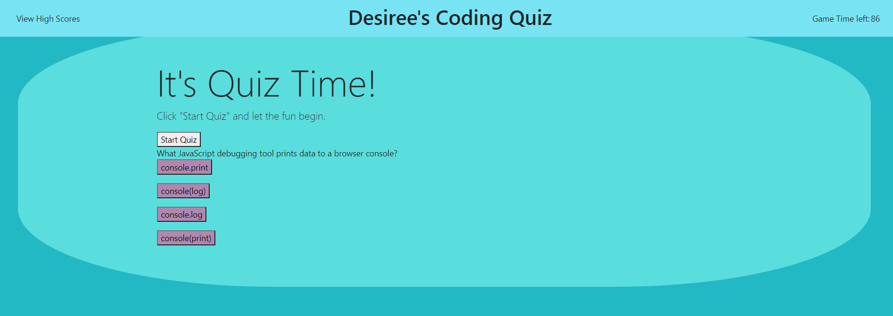

# Code Quiz

This CodeQuiz is a fun way to test your coding knowledge!  Here's how it works:

From the home page, the user has an option to click a button to "Start Quiz".

Upon clicking the button, the timer begins at 100 seconds and the user is presented with a series of questions. 

The user's score is dependant upon how quickly they're able to correctly complete the questions.  Time remaining on the clock becomes the user's score.  Answer quickly and correctly, you might just beat the high score! Answer incorrectly, ouch!  Brace yourself for a time penalty (15 seconds are subtracted from time remaining).  User will be prompted to enter initials.  Once user inputs their initials,  high score and initials will be displayed on the screen, saved to local storage, and visible in console log.  

# Technology Used

HTML
CSS
JavaScript
JSON

# Deployed

Repo Link:  https://github.com/DesCoding/CodeQuiz.git

Site Link:  https://descoding.github.io/CodeQuiz/index.html

# Demo

# MIT License

Copyright (c) 2021 DesCoding

Permission is hereby granted, free of charge, to any person obtaining a copy
of this software and associated documentation files (the "Software"), to deal
in the Software without restriction, including without limitation the rights
to use, copy, modify, merge, publish, distribute, sublicense, and/or sell
copies of the Software, and to permit persons to whom the Software is
furnished to do so, subject to the following conditions:

The above copyright notice and this permission notice shall be included in all
copies or substantial portions of the Software.

THE SOFTWARE IS PROVIDED "AS IS", WITHOUT WARRANTY OF ANY KIND, EXPRESS OR
IMPLIED, INCLUDING BUT NOT LIMITED TO THE WARRANTIES OF MERCHANTABILITY,
FITNESS FOR A PARTICULAR PURPOSE AND NONINFRINGEMENT. IN NO EVENT SHALL THE
AUTHORS OR COPYRIGHT HOLDERS BE LIABLE FOR ANY CLAIM, DAMAGES OR OTHER
LIABILITY, WHETHER IN AN ACTION OF CONTRACT, TORT OR OTHERWISE, ARISING FROM,
OUT OF OR IN CONNECTION WITH THE SOFTWARE OR THE USE OR OTHER DEALINGS IN THE
SOFTWARE.

# Contact Info
d.stout31@yahoo.com